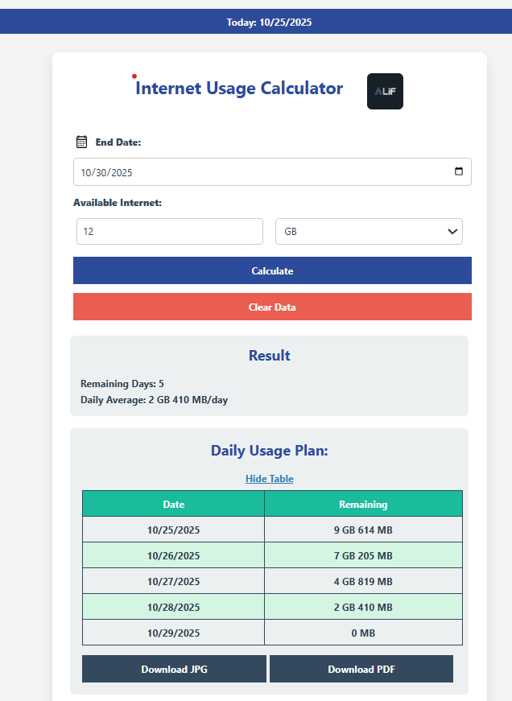

# Bandwidth Calculator


A web application to calculate and plan daily internet bandwidth usage based on the total available data and remaining days. Perfect for managing your internet usage efficiently.

---

## 🌐 Live Demo
Try it online: <a href="https://bandwidth-calculator.netlify.app/" target="_blank" rel="noopener noreferrer">Bandwidth Calculator Demo</a>


---

## 🌟 Features

- Calculate remaining internet bandwidth per day  
- Supports both GB and MB units  
- Daily usage plan table  
- Download plan as JPG or PDF  
- Clear and user-friendly interface  
- Responsive design for mobile and desktop

---

## 🖼 Screenshot / Preview



 

---

## 📂 Repository Structure

bandwidth-calculator/
- `index.html`       – Main HTML file
- `style.css`        – CSS styles
- `script.js`        – JavaScript functionality
- `photo.jpg`        – Logo or header image
- `screenshot.png`   – Screenshot of the app
- `Main.py`          - Python Code

---

## ⚙️ Technologies Used

- **HTML5** – Structure of the web page  
- **CSS3** – Styling, layout, and responsive design  
- **JavaScript (Vanilla JS)** – Calculator logic, table generation  
- **html2canvas** – Capture screenshot of daily usage plan for JPG  
- **jsPDF** – Export usage plan as PDF  
- **Font Awesome** – Icons used in buttons and UI

## 💻 Installation

1. Clone the repository:

```bash
git clone https://github.com/With-ALIF/bandwidth-calculator.git
